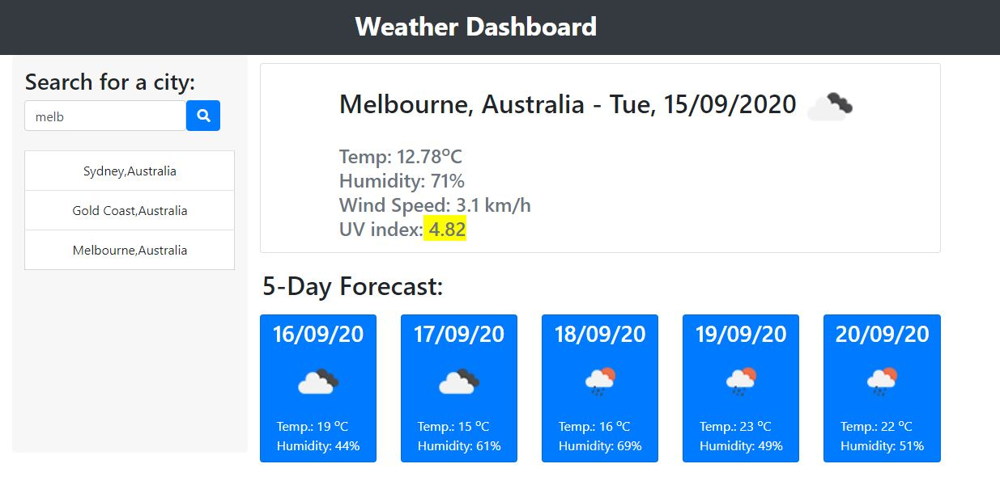

# Weather Dashboard

## Description
This is a Weather Dashboard Application. The application uses localStorage to store your favourite cities 
(your search history). The application uses user's public IP address to determine their city and geo location for initial run. 

### Three Options to display City's weather
1. Using search bar then submitting (Press Enter or the search button)
2. Clicking one of the serach history/ favourite cities
3. Clicking on the drop list that appears at the search bar.

## Features
* First run will display current city's weather 

 
* The app saves into local storage a list of cities and countries and checks if present on every run, if not it will be stored, so as to save user's data by downloading it only once and storing into local storage.

* When you type into the search bar more than 3 characters, the matching cities will be displayed in a dropdown menu. **Search is not case sensetive and can be any 4 successive characters in the city name**

* When you click a city from the dropdown, the app will lookup the favourite cities and if not there will be added both on screen and into local storage and its weather data will be rendered and displayed on the screen, otherwise it will be only displayed onto the screen. **To remove a city from favourites `Double-Click it**

* If you have chosen to use `Enter/Return` key or the search button , the app will do same behaviour as above considering the first city appearing in the drop down list. **Google's `I am feeling Lucky Concept`

## Test
You many try the Weather Dashboard App by simply following the link to [Weather Dashboard App](https://tonymelek.github.io/weather_dashboard/).

## Feedback
You are welecome to provide any feedback or comments on the code to be sent to my e-mail [tonymelek.au@gmail.com](mailto:tonymelek.au@gmail.com)

## License
Weather Dashboard App is &copy; copyight to Tony Melek 2020
